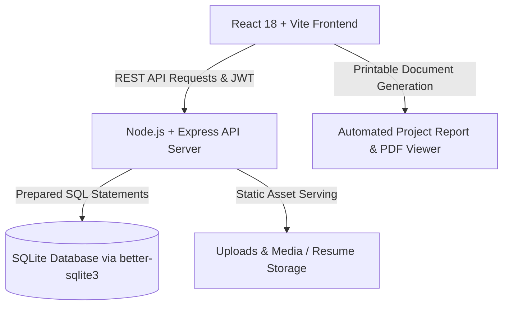

# 🚀 Garvit Kaurav — Full-Stack Personal Portfolio & Dynamic Admin CMS

A modern, responsive, production-ready Full-Stack Personal Portfolio and Dynamic Content Management System (CMS) designed and built for **Garvit Kaurav** (B.Tech in Computer Science and Engineering specializing in Artificial Intelligence at Galgotias College of Engineering and Technology).


---

## 🌟 Key Features

### 👤 1. Public Portfolio Experience
- **Dynamic Hero Section**: Interactive particle network background, rotating typewriter headlines, 3D glowing avatar card, and quick resume download trigger.
- **Academic Foundation**: Highlighting B.Tech in CSE (AI) at **Galgotias College of Engineering and Technology (CGPA: 7.68)**.
- **Skills Matrix**: Categorized competencies across **Languages** (Python, SQL, Java), **Platforms** (MySQL, Power BI, Canva), **Tools & ML** (Scikit-learn, Pandas, NumPy, Data Visualization), **Coursework** (DSA, DAA, DBMS, OS, Software Engineering), and **Soft Skills**.
- **Filterable Projects Showcase**: Deep dive specifications for **Fraud Transaction Detection** (ML/Python), **Personal Expense Tracker** (DBMS/Full-Stack), and **Cybersecurity Simulations** (Packet Tracer) with live demo and GitHub links.
- **Interactive Experience Timeline**: Showcasing internships at **Cisco Networking Academy** (Cybersecurity Analyst Trainee) and **Softpro India** (Machine Learning Intern).
- **Education & Certifications**: Detailed schooling records (St. Crispin's Sr. Sec. School CBSE 73% & 83.66%) and verified industry credentials (Accenture, MasterCard, Google GenAI, Udemy).
- **Leadership & Summits**: Highlights of **GIMUN'25**, **GIH'25**, **Unifest'26**, **GFGSC**, **GDG**, and **InfoSec Diary** leadership.
- **Interactive Contact Form**: Instant validation, real-time toast feedback, confetti animation on submission, and rapid response SLA guarantee.
- **Theme Switcher**: Smooth Dark / Light glassmorphism theme toggling with persistent user preference storage.
- **In-Browser Resume Viewer**: One-click printable and downloadable CV modal.

---

### 🛡️ 2. Dynamic Admin CMS Dashboard (`/admin`)
- **JWT & Bcrypt Authentication**: Secure login protecting all CRUD administrative endpoints.
- **Analytics & Traffic Overview**: Real-time counter of total page visits, unique visitors, message counts, and active projects.
- **Complete Content Management**:
  - **Profile Manager**: Edit headline, tagline, bio narrative, phone, email, and social links.
  - **Skills Manager**: Add, edit, adjust proficiency percentages, and delete technical skills.
  - **Projects Manager**: Create projects, upload metrics, add GitHub & live demo URLs, and filter categories.
  - **Experience & Internships**: Manage job titles, bullet highlights, and company info.
  - **Education Manager**: Manage degrees, institutions, and CGPA scores.
  - **Achievements & Certifications**: Manage verified credential badges and leadership records.
  - **Inquiries Inbox**: Read contact form submissions, mark as read/unread, star messages, and one-click email reply trigger.
  - **Security Manager**: Update admin passwords securely.

---

## 🏛️ System Architecture



---

## 📦 Tech Stack

| Layer | Technology | Details |
|---|---|---|
| **Frontend** | React 18, Vite | Ultra-fast client rendering, Lucide icons, Canvas confetti |
| **Styling** | Vanilla CSS Glassmorphism | Custom design tokens, dark/light themes, smooth transitions |
| **Backend** | Node.js & Express.js | RESTful API architecture, JSON body parsing, CORS |
| **Database** | SQLite & `better-sqlite3` | High-throughput relational storage with prepared statements |
| **Authentication** | JWT & `bcryptjs` | Bearer token authorization with 10 salt rounds |
| **File Handling** | Multer | File uploads for profile avatars and resume attachments |

---

## 🔑 Default Admin Credentials

> [!IMPORTANT]
> The database is automatically seeded with pre-configured administrative credentials:
> - **Email / Username**: `admin@garvit.dev` (or `garvitkaurav@gmail.com`)
> - **Password**: `Admin@12345`
> 
> You can change the password at any time from the **Security** tab in the Admin Dashboard.

---

## 🚀 Quick Start Guide

### 1. Clone & Install Dependencies
```bash
# Clone the repository
git clone https://github.com/garvitkaurav/personal-portfolio.git
cd personal-portfolio

# Install root, backend, and frontend dependencies
npm run install:all
```

### 2. Initialize and Seed Database
```bash
# Automatically creates tables and seeds Garvit's resume credentials
npm run seed
```

### 3. Run Development Server
```bash
# Concurrently launches backend on http://localhost:5000 and frontend on http://localhost:3000
npm run dev
```

- **Frontend URL**: `http://localhost:3000`
- **Backend API**: `http://localhost:5000/api`
- **Health Check**: `http://localhost:5000/api/health`

---

## 📡 REST API Reference

### 🔐 Authentication
- `POST /api/auth/login` — Authenticate and retrieve JWT token
- `GET /api/auth/me` — Verify current session token (Protected)
- `POST /api/auth/change-password` — Change admin password (Protected)

### 👤 Profile
- `GET /api/profile` — Fetch public profile information
- `PUT /api/profile` — Update profile details (Protected)

### 💻 Skills
- `GET /api/skills` — Fetch all skills categorized
- `POST /api/skills` — Add new skill (Protected)
- `PUT /api/skills/:id` — Update skill (Protected)
- `DELETE /api/skills/:id` — Delete skill (Protected)

### 📂 Projects
- `GET /api/projects` — Fetch projects with optional `?category=` filter
- `POST /api/projects` — Create project (Protected)
- `PUT /api/projects/:id` — Update project (Protected)
- `DELETE /api/projects/:id` — Delete project (Protected)

### 💼 Experience & Education
- `GET /api/experiences` | `POST /api/experiences` (Protected)
- `GET /api/education` | `POST /api/education` (Protected)
- `GET /api/achievements` | `POST /api/achievements` (Protected)
- `GET /api/certifications` | `POST /api/certifications` (Protected)

### 📬 Contact Messages & Analytics
- `POST /api/messages` — Submit contact inquiry (Public)
- `GET /api/messages` — Retrieve inbox messages (Protected)
- `PATCH /api/messages/:id` — Toggle read/starred status (Protected)
- `DELETE /api/messages/:id` — Remove message (Protected)
- `POST /api/analytics/visit` — Log page traffic
- `GET /api/analytics/stats` — Retrieve visitor statistics (Protected)

---

## 📂 Project Structure

```
├── client/                     # Frontend Application (React + Vite)
│   ├── src/
│   │   ├── admin/              # Admin CMS Components & Tab Managers
│   │   │   ├── tabs/           # Profile, Skills, Projects, Messages, Security managers
│   │   │   ├── AdminDashboard.jsx
│   │   │   └── AdminLogin.jsx
│   │   ├── components/         # Public Portfolio Components (Navbar, Hero, About, Skills, Projects, etc.)
│   │   ├── context/            # AuthContext & ThemeContext
│   │   ├── services/           # Unified API client service (api.js)
│   │   ├── App.jsx             # Main Application root
│   │   ├── index.css           # Pure Modern Glassmorphism Design System
│   │   └── main.jsx
│   ├── index.html
│   ├── package.json
│   └── vite.config.js
│
├── server/                     # Backend API (Node.js + Express + SQLite)
│   ├── db/
│   │   ├── database.js         # SQLite connector via better-sqlite3
│   │   ├── schema.sql          # Relational database schema
│   │   └── seed.js             # Resume seed script
│   ├── middleware/
│   │   └── auth.js             # JWT verification middleware
│   ├── routes/                 # Express REST route controllers
│   ├── index.js                # Express app entry point
│   └── package.json
│
├── PROJECT_REPORT.md           # Formal Academic & Technical Project Report
├── README.md                   # Complete Documentation (This file)
└── package.json                # Root orchestration scripts
```

---

## 📜 Deliverables Checklist
- [x] **Public GitHub Repository Structure**: Clean monorepo with separation of client and server.
- [x] **Complete Source Code**: Zero placeholder files, fully operational full-stack application.
- [x] **README Documentation**: Architecture diagrams, setup instructions, and API guide.
- [x] **Database Schema**: SQL schema file (`schema.sql`) and seed script.
- [x] **Project Report**: Comprehensive printable project report (`PROJECT_REPORT.md` + in-browser printable viewer).

---

## 👨‍💻 Author

**Garvit Kaurav**  
*Galgotias College of Engineering and Technology*  
- ✉️ **Email**: [garvitkaurav@gmail.com](mailto:garvitkaurav@gmail.com)  
- 📞 **Phone**: +91 8376853268  
- 💼 **LinkedIn**: [linkedin.com/in/garvitkaurav](https://linkedin.com/in/garvitkaurav)  
- 🐙 **GitHub**: [github.com/garvitkaurav](https://github.com/garvitkaurav)
